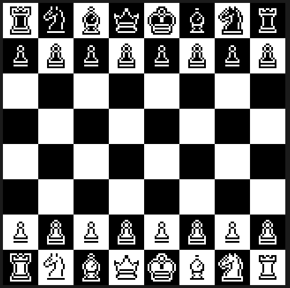
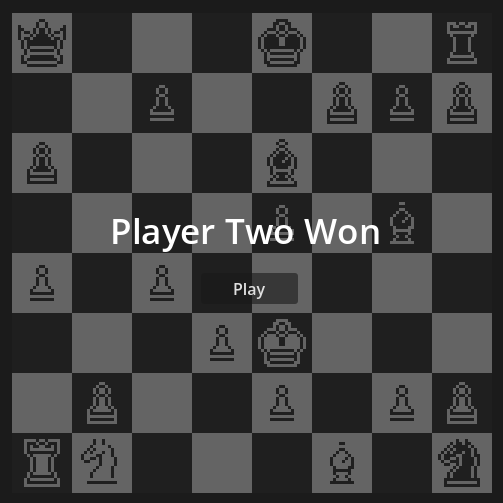

# Chess Game in Godot 4

A complete 2D chess game built in Godot 4, featuring full chess rules, drag-and-drop piece movement, pawn promotion, and a strategic AI opponent powered by minimax search with alpha-beta pruning.





## Features

- **Full Chess Rules** — all pieces move correctly including pawns (double push, diagonal capture), promotion to queen, and check detection
- **Strategic AI** — minimax search at depth 3 with alpha-beta pruning, centipawn piece values, and piece-square tables for positional play
- **Non-blocking AI** — search runs on a background thread so the game stays responsive while the AI thinks
- **Move Indicators** — green dots for valid moves, red dots for captures
- **Player vs AI** — play as White against the computer (Black)

## How to Play

1. Open the project in Godot 4
2. Press **F5** or click the Play button to run the game
3. Drag and drop your pieces to make a move — valid squares are highlighted
4. The AI responds automatically as Black

## Project Structure

```
scripts/
  game.gd      # Game logic, AI (minimax), input handling
  board.gd     # Board rendering and piece management
  piece.gd     # Piece movement rules
  globals.gd   # Enums and constants
scenes/
  game.tscn    # Main game scene
  Piece.tscn   # Piece scene
```

## AI Details

The AI uses:
- **Minimax with alpha-beta pruning** (depth 3) — looks 3 half-moves ahead
- **Centipawn piece values** — Pawn=100, Knight=320, Bishop=330, Rook=500, Queen=900, King=20000
- **Piece-square tables** — positional bonuses rewarding central control, king safety, and piece activity
- **Move ordering** — captures evaluated first to maximise pruning efficiency
- **Lightweight board representation** — search uses plain data structures (no scene nodes) for fast simulation

