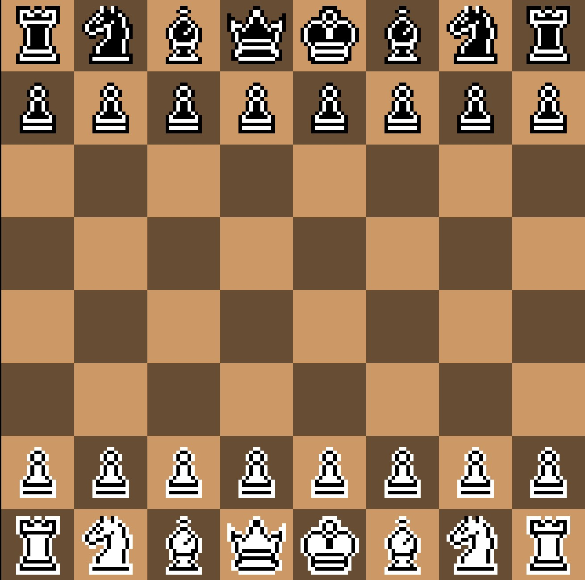
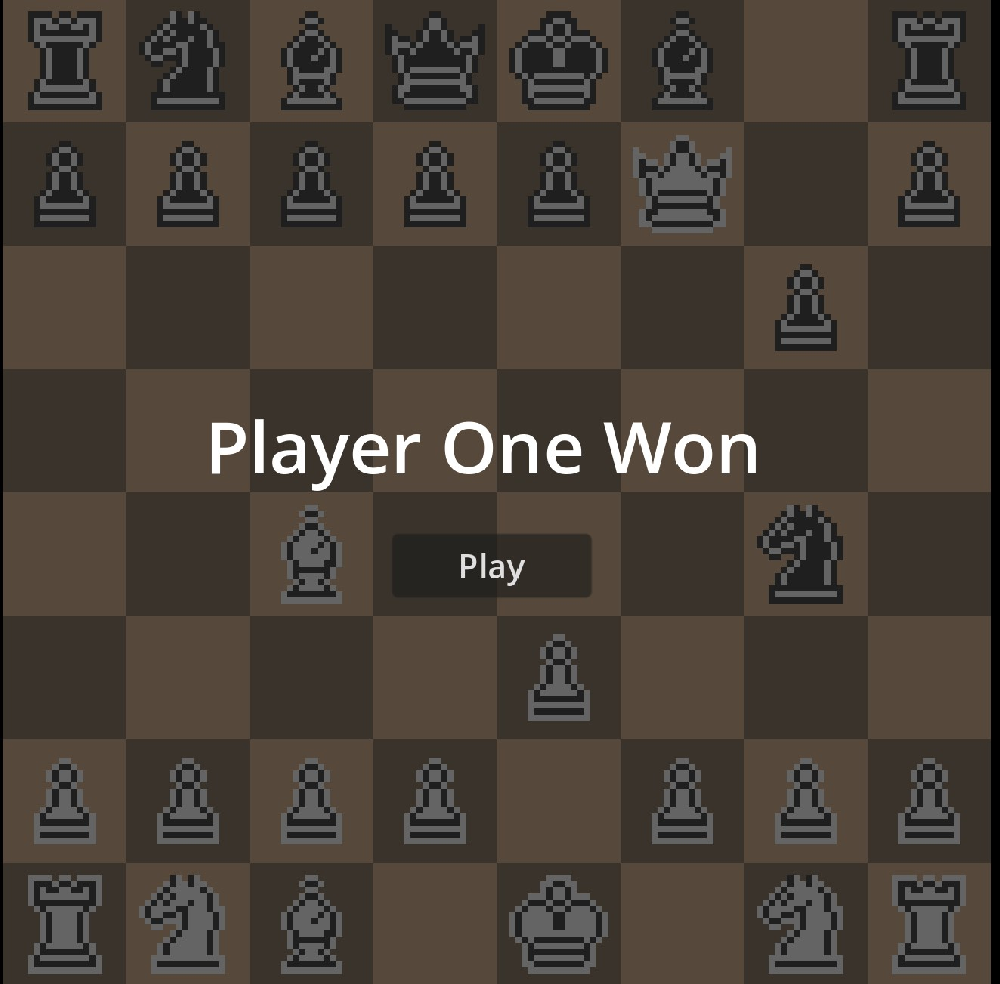

# Chess Game in Godot 4

A complete chess game built in Godot 4, featuring full chessboard setup, proper piece movement and a simple AI opponent.

Try the game now: [https://rahuldshetty.itch.io/pixel-chess](https://rahuldshetty.itch.io/pixel-chess)

## Features

- **Standard Chess Rules:** Implements international chess rules for all pieces (including proper pawn movement and capturing).
- **Simple AI:** A basic AI that selects random valid moves for Black.
- **Player vs Player Mode**: Play against other human players.

## Contributing

Contributions are welcome! If you have ideas or improvements, feel free to fork this repository and open a pull request.

## License

This project is licensed under the MIT License. See the [LICENSE](LICENSE) file for details.
